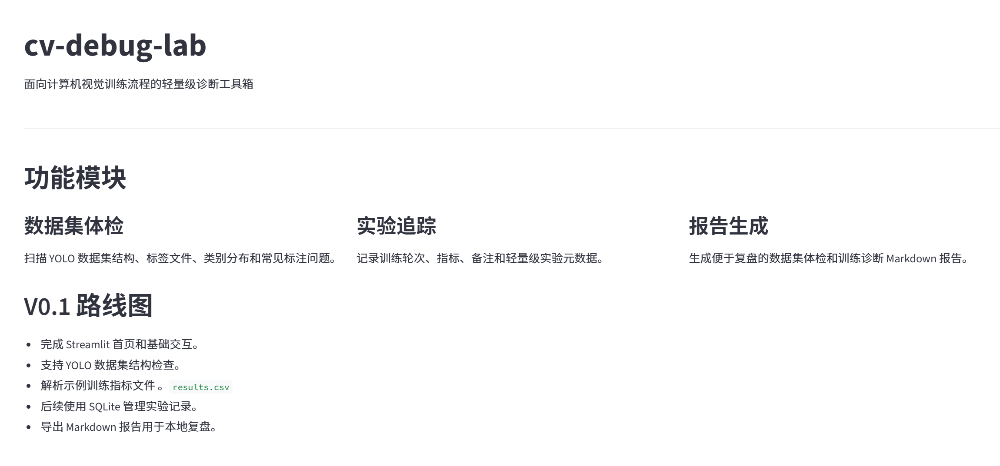
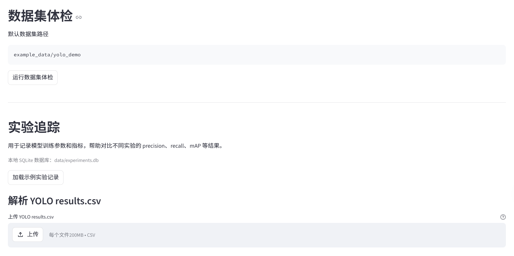
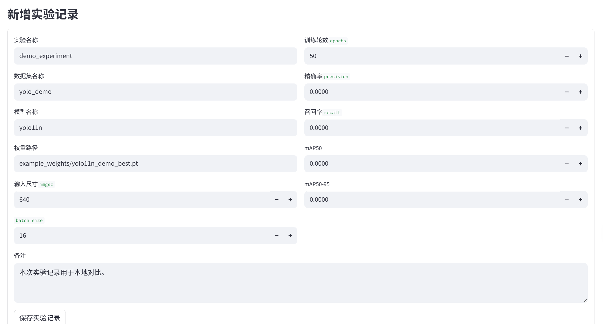
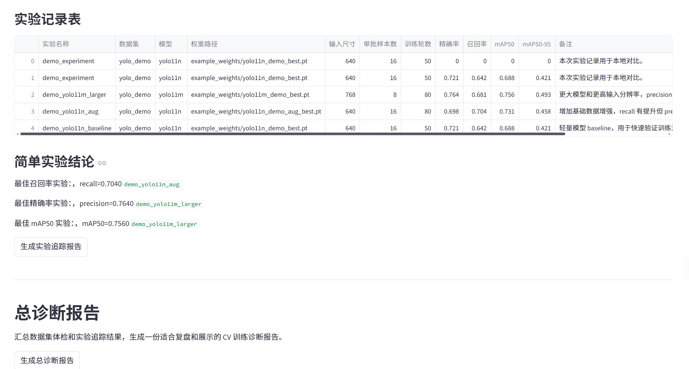

<div align="center">

# cv-debug-lab

面向计算机视觉训练流程的轻量级诊断工具箱

**A lightweight debugging toolkit for computer vision training workflows.**


</div>

## 这个项目解决什么问题

训练一个 YOLO/CV 模型时，效果不好不一定是模型本身的问题。很多时候，真正影响结果的是更基础的工程环节：

- 图片和标签没有一一对应
- 标签文件为空但没有记录
- bbox 越界或宽高非法
- train/val 划分不清晰
- 类别分布不均衡
- 每次实验的 precision、recall、mAP 没有持续记录
- 训练结果缺少可复盘的报告

`cv-debug-lab` 把这些检查动作做成一个本地 Streamlit 工具箱：先检查数据集，再记录实验，最后生成一份完整的中文训练诊断报告。

## 功能一览

| 模块 | 能力 | 输出 |
|---|---|---|
| Dataset Auditor | 检查 YOLO 数据集结构、标签质量、类别分布和每图目标数 | `reports/dataset_audit_report.md` |
| Experiment Tracker | 解析 `results.csv`，记录实验参数和指标，对比最佳实验 | `reports/experiment_report.md` |
| Report Generator | 汇总数据集体检和实验追踪结果，给出诊断结论和下一步建议 | `reports/cv_debug_report.md` |

## 核心亮点

- **面向真实训练流程**：不是单独画图或展示指标，而是围绕训练前检查、训练后记录、复盘报告三个阶段组织功能。
- **YOLO 数据集体检**：自动识别空标签、缺失标签、孤立标签、bbox 越界、bbox 宽高非法等常见问题。
- **实验记录本地化**：使用 SQLite 保存实验记录，不依赖外部服务，适合个人项目快速复盘。
- **中文 Markdown 报告**：一键生成数据集报告、实验报告和总诊断报告，方便直接放入项目文档。
- **开箱即用示例数据**：项目内置模拟 YOLO 数据集和模拟 `results.csv`，克隆后即可体验完整流程。

## 项目截图

### 首页



### 数据集体检



### 实验追踪



### 总诊断报告



## 快速开始

Windows PowerShell 示例：

```powershell
conda create -n cv-debug-lab python=3.11 -y
conda activate cv-debug-lab
pip install -r requirements.txt
streamlit run app.py
```

启动后，按下面顺序体验：

1. 点击 `运行数据集体检`
2. 点击 `加载示例实验记录`
3. 上传或使用 `example_data/yolo_results/results.csv` 解析 YOLO 指标
4. 点击 `生成实验追踪报告`
5. 点击 `生成总诊断报告`

## 页面结构

```text
cv-debug-lab
├─ 功能模块总览
├─ 数据集体检
│  ├─ 数据集总览
│  ├─ train/val 分布
│  ├─ 类别分布
│  ├─ 数据集问题清单
│  └─ 每张图片目标框数量
├─ 实验追踪
│  ├─ YOLO results.csv 解析
│  ├─ 新增实验记录
│  ├─ 实验记录表
│  └─ 简单实验结论
└─ 总诊断报告
   ├─ 关键诊断摘要
   └─ Markdown 报告生成
```

## 示例数据

项目内置一份小型模拟 YOLO 数据集：

```text
example_data/yolo_demo/
  images/
    train/
    val/
  labels/
    train/
    val/
```

这份数据集用于演示 Dataset Auditor 的检查能力，覆盖以下情况：

- 正常标签
- 空标签文件
- bbox 越界
- bbox 宽高非法
- 图片缺少标签
- 标签缺少图片

同时提供一份模拟 YOLO 训练结果：

```text
example_data/yolo_results/results.csv
```

可用于演示 precision、recall、mAP50、mAP50-95 的自动解析。

## 数据说明

本仓库中的图片、标签、训练指标和报告内容均为演示用途的模拟样例，仅用于说明工具功能和页面交互。项目不依赖外部业务系统或私有数据源，运行时产生的本地数据库文件会保存在 `data/` 目录，并由 `.gitignore` 排除。

## 报告样例

项目当前会生成三类 Markdown 报告：

| 报告 | 说明 |
|---|---|
| `reports/dataset_audit_report.md` | 数据集体检报告，聚焦数据结构和标注质量 |
| `reports/experiment_report.md` | 实验追踪报告，聚焦训练参数和指标对比 |
| `reports/cv_debug_report.md` | 总诊断报告，汇总数据问题、实验表现和下一步建议 |

总诊断报告会包含：

- 报告概览
- 数据集体检摘要
- 实验追踪摘要
- 自动诊断结论
- 下一步建议

## 项目结构

```text
cv-debug-lab/
  app.py                         # Streamlit 应用入口
  requirements.txt               # Python 依赖
  src/
    dataset_auditor.py           # YOLO 数据集体检逻辑
    experiment_tracker.py        # 实验追踪和 SQLite 记录逻辑
    report_generator.py          # Markdown 报告生成逻辑
    utils.py                     # 通用工具函数
  example_data/
    yolo_demo/                   # 模拟 YOLO 数据集
    yolo_results/results.csv     # 模拟 YOLO 训练结果
  reports/                       # 示例 Markdown 报告
  screenshots/                   # 项目截图目录
  docs/                          # 项目说明文档
  data/                          # 本地运行数据目录
```

## 技术栈

| 类型 | 技术 |
|---|---|
| Web UI | Streamlit |
| 数据处理 | Pandas |
| 示例图片生成 | Pillow |
| 本地存储 | SQLite |
| 运行环境 | Python 3.11 |

## 当前状态

- V0.1 已完成项目骨架、数据集体检、实验追踪和总诊断报告。
- 示例数据和示例报告已放入仓库，便于直接查看效果。

## Roadmap

- 误检漏检分析 Error Analyzer
- 阈值/NMS 扫描
- hard case 样本管理
- 更多可视化图表
- README 英文版 `README_EN.md`
- GitHub Release 版本整理
